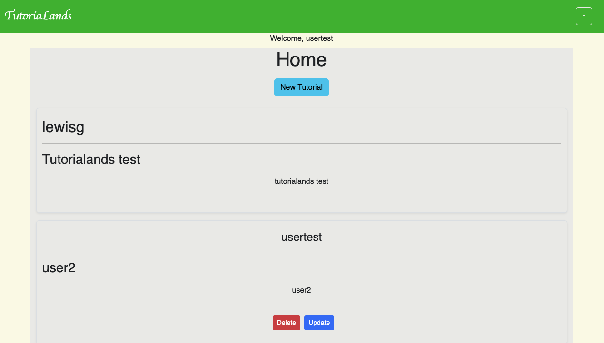

# Tutorialands

## "Tutorialands" is a web app where users can guide each other

"Tutorialands" is a web app where users can guide each other through the process of learning a new skill. Users can create tutorials,
and other guides for other users to follow. Tutorials can contain text, images, videos, and links. Tutorials can be commented on, bookmarked, and given ratings.

## App Gallery

## Technologies

* HTML5
* CSS3
* JavaScript
* Mongoose
* Express
* Node.js
* MongoDB
* React
* Bootstrap

## Getting Started

Live App: [Live App](https://tutorialands-client.onrender.com)

Trello Board: [Trello Board](https://trello.com/b/cn7mc7jn/p4)

## What's Next

#### Version 2.0
* add images to tutorials
* Add a search bar to the home page
* Ability to favorite tutorials
* Add a favorites page

#### Version 3.0

* Add admin accounts
* Add comments to tutorials
* Ability to like or dislike tutorials
---

## Author

Lewis Graves - Lewisg735@gmail.com